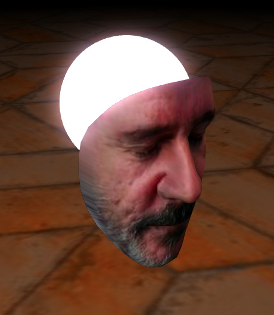

# facecap
Babylon.js + Mediapipe face capture

You need a webcam for this one.

Demo:
https://imerso.github.io/babylon.js/facecap

    

No node.js and npm used here, so you'll need to host it on a webserver to check the demo.

After opening this demo on your browser, just look directly to your webcam, and you will see your face in 3D. You can zoom, pan and rotate around, toggle wireframe and export to gltf. That is it.

This simple thing could be useful to easily capture a face and put it on a 3D character.

